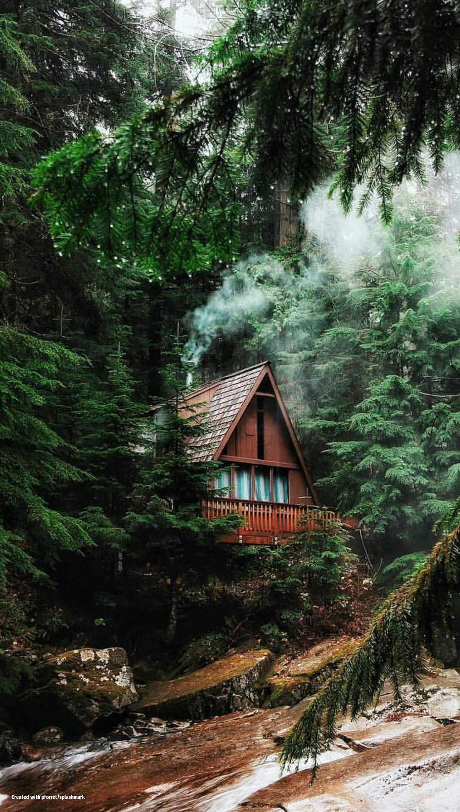
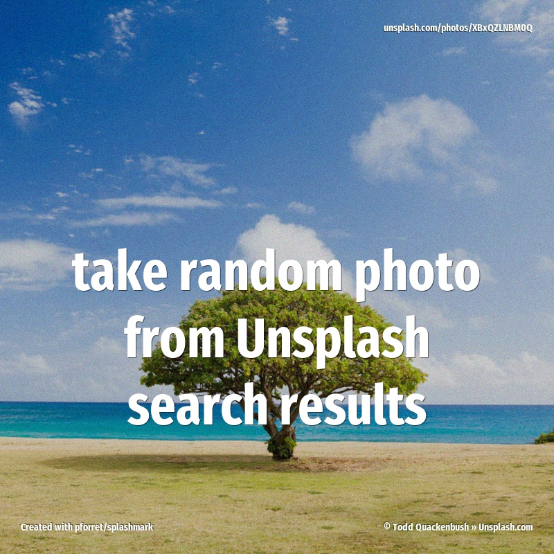
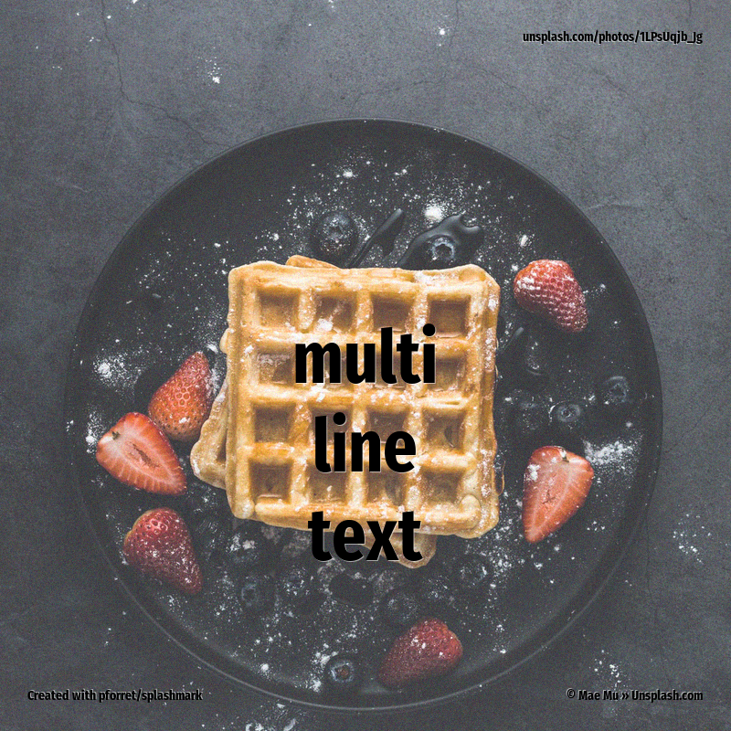
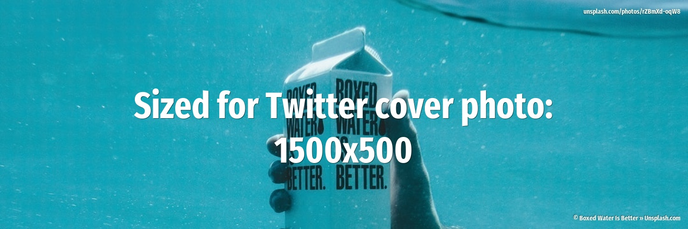
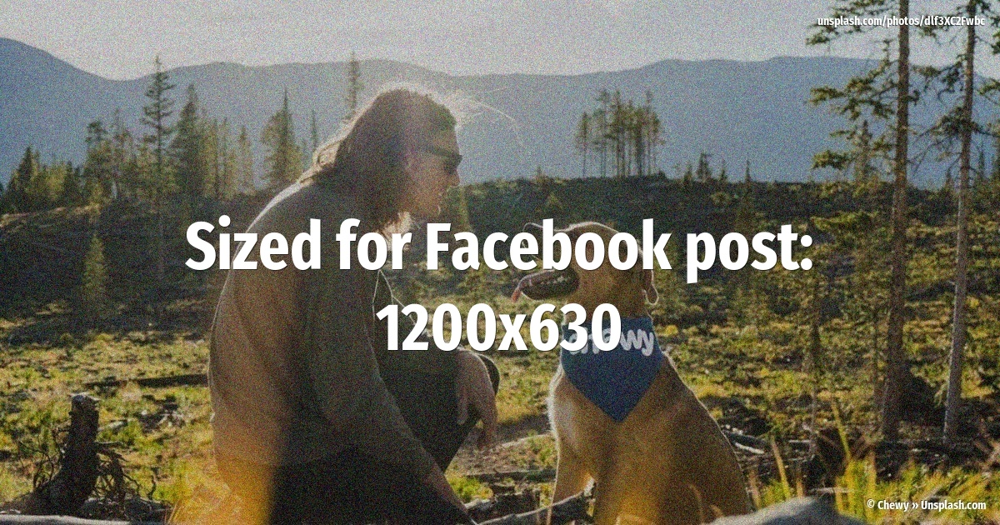

        splashmark download ./examples/basic_scale.jpg https://unsplash.com/photos/FzthdgL6vBI

---
 
        splashmark -w 700 -c 600 search ./examples/basic_crop.jpg night

---
 
        splashmark -w 800 -c 800 --randomize 5 -e dark,grain -i take random photo\nfrom Unsplash\nsearch results search ./examples/random.jpg tree

---
 
        splashmark -w 700 -c 500 -e light,grain -i filter: light,grain search ./examples/fx_horse.jpg horse

---
 
        splashmark -w 1000 -c 600 -p AvantGarde-Demi -o 16 -i Custom fonts -e median,paint,grain search ./examples/text_fonts.gif steak

---
 
        splashmark --width 400 --effect grain,bw,light -i multi\nline\ntext search ./examples/text_lines.png puppy

---
 
        splashmark -w 1000 -c 500 -p FiraCode-Regular.ttf -o 12 -e paint,dark,grain -i Use the 4 corners -1 font: Fira Code, via Google Fonts -2 Photo: {url} -3 www.example.com -4 {copyright} search ./examples/text_corners.jpg code

---
 
        splashmark -w 700 -c 600 -e dark,blur,grain -z 100 -g West -i Left aligned search ./examples/text_left.jpg paris

---
 
        splashmark -m 30 -w 800 -c 800 -e dark,grain -r FFFD -z 100 -i Big titles -j 40 -k as well as small smaller subtitles -p SansitaSwashed-Bold.ttf search ./examples/text_subtitles.jpg hope

---
 
        splashmark -w 1280 -c 640 -i sized for Github\n'social preview':\n1280x640 -e dark,grain -3 created with pforret/splashmark -p fonts/FiraCode-Regular.ttf search ./examples/size_github.jpg splash

---
 
        splashmark -w 1080 -c 1080 -e dark,grain -i Sized for instagram posts:\n1080x1080 -p SansitaSwashed-Bold.ttf search ./examples/size_instagram.jpg beach

---
 
        splashmark -w 1500 -c 500 -i Sized for Twitter cover photo: 1500x500 search ./examples/size_twitter.jpg sea

---
 
        splashmark -w 1200 -c 630 -e dark,grain -i Sized for Facebook post:\n1200x630 search ./examples/size_facebook.jpg friends

---
 
