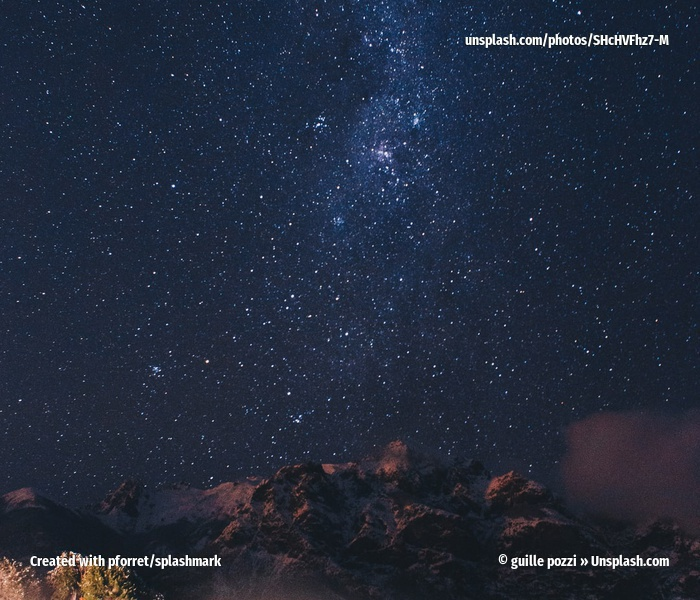
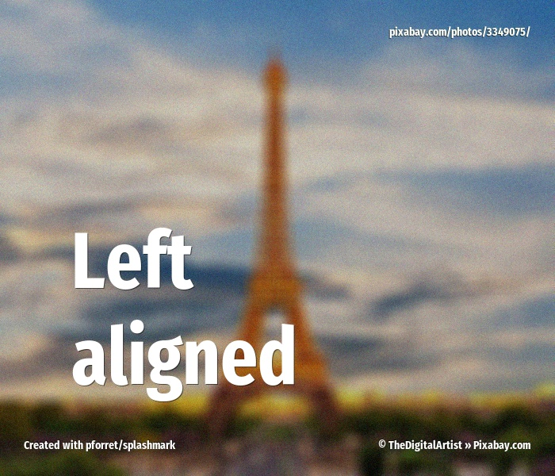
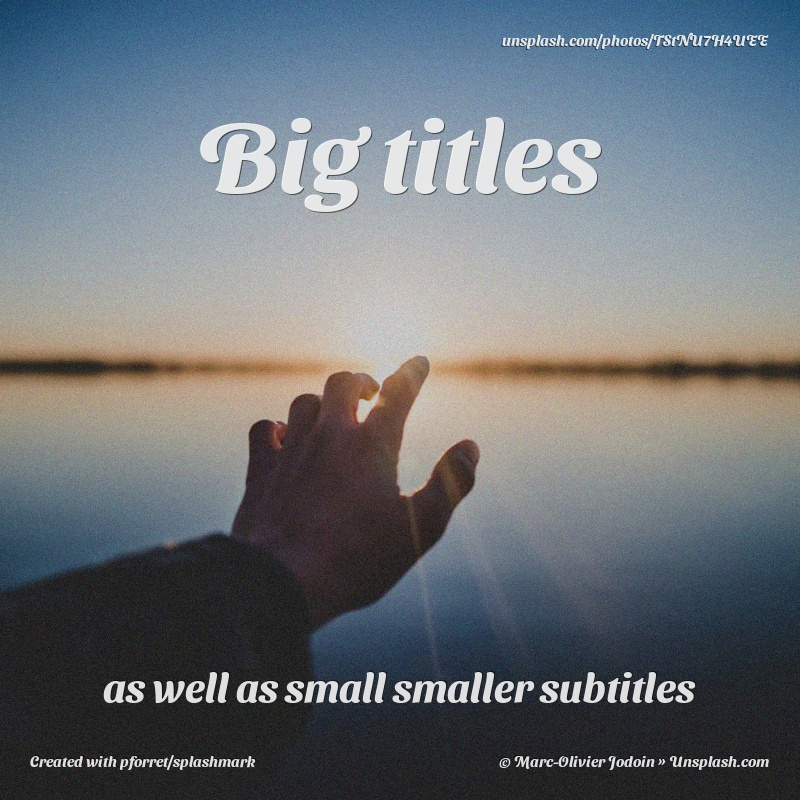
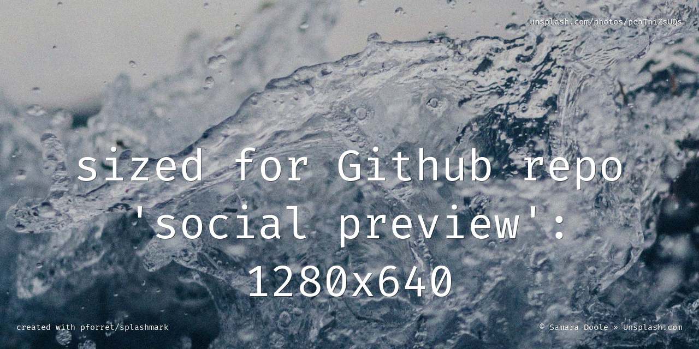

# SplashMark examples
 
        splashmark url https://i.pinimg.com/originals/34/7a/ec/347aec03a73c9f0a027960395fd1fd97.jpg ./examples/basic_scale.jpg 

---
 
        splashmark -w 700 -c 600 unsplash night ./examples/basic_crop.jpg 

---
 
        splashmark -w 800 -c 800 --randomize 5 -e dark,grain -i "take random photo\nfrom Unsplash\nsearch results" unsplash tree ./examples/random.jpg

---
 
        splashmark -w 700 -c 500 -e light,grain -i "filter: light,grain" unsplash horse ./examples/fx_horse.jpg

---
 
        splashmark -w 1000 -c 600 -p AvantGarde-Demi -o 16 -i "Custom fonts" -e median,paint,grain unsplash steak ./examples/text_fonts.gif

---
 
        splashmark --width 800 --crop 800 --effect light,grain --fontcolor 000 --title "multi\nline\ntext" unsplash waffle ./examples/text_lines.png

---
 
        splashmark -w 1000 -c 500 -p FiraCode-Regular.ttf -o 12 -e paint,dark,grain -i "Use the 4 corners" -1 "font: Fira Code, via Google Fonts" -2 "Photo: {url}" -3 "www.example.com" -4 "{copyright}" unsplash code ./examples/text_corners.jpg

---
 
        splashmark -w 700 -c 600 -e dark,blur,grain -z 100 -g West -p FiraSansExtraCondensed-Bold.ttf -i "Left\naligned" pixabay paris ./examples/text_left.jpg

---
 
        splashmark -m 30 -w 800 -c 800 -e dark,grain -r FFFD -z 100 -i "Big titles" -j 40 -k "as well as small smaller subtitles" -p SansitaSwashed-Bold.ttf unsplash hope ./examples/text_subtitles.jpg

---
 
        splashmark -s github:repo -i "sized for Github repo\n'social preview':\n1280x640" -e dark,grain -3 "created with pforret/splashmark" -p fonts/FiraCode-Regular.ttf unsplash splash ./examples/size_github.jpg

---
 
        splashmark -s instagram:square -e dark,grain -i "Sized for instagram posts:\n1080x1080" -p SansitaSwashed-Bold.ttf unsplash beach ./examples/size_instagram.jpg

---
 
