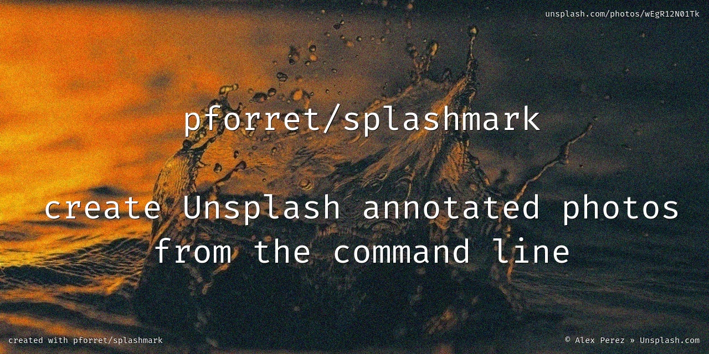

 

# splashmark

Download unsplash pics and
* resize
* crop
* add graphic affects (blur/monochrome/darken/...)
* add attribution (by saving it as EXIF/IPTC meta data)
* add watermarks (Unsplash URL or other)

## Usage

    Program: splashmark 2.3.0 created on 2020-09-28 by peter@forret.com
    Updated: 2020-10-10 13:45
    Usage: splashmark [-h] [-q] [-v] [-1 <northwest>] [-2 <northeast>] [-3 <southwest>] [-4 <southeast>] [-c <crop>] [-d <randomize>] [-e <effect>] [-g <gravity>] [-i <title>] [-j <subtitlesize>] [-k <subtitle>] [-l <log_dir>] [-m <margin>] [-o <fontsize>] [-p <fonttyp
    e>] [-r <fontcolor>] [-t <tmp_dir>] [-u <url>] [-w <width>] [-x <photographer>] [-z <titlesize>] <action> <output> <input>
    Flags, options and parameters:
        -h|--help      : [flag] show usage [default: off]
        -q|--quiet     : [flag] no output [default: off]
        -v|--verbose   : [flag] output more [default: off]
        -1|--northwest <val>: [optn] text to put in left top
        -2|--northeast <val>: [optn] text to put in right top  [default: {url}]
        -3|--southwest <val>: [optn] text to put in left bottom
        -4|--southeast <val>: [optn] text to put in right bottom  [default: {copyright2}]
        -c|--crop <val>: [optn] image height for cropping  [default: 0]
        -d|--randomize <val>: [optn] take a random picture in the first N results  [default: 1]
        -e|--effect <val>: [optn] use effect chain on image: bw/blur/dark/grain/light/median/paint/pixel
        -g|--gravity <val>: [optn] title alignment left/center/right  [default: center]
        -i|--title <val>: [optn] big text to put in center
        -j|--subtitlesize <val>: [optn] font size for subtitle  [default: 50]
        -k|--subtitle <val>: [optn] big text to put in center
        -l|--log_dir <val>: [optn] folder for log files   [default: log]
        -m|--margin <val>: [optn] margin for watermarks  [default: 15]
        -o|--fontsize <val>: [optn] font size for watermarks  [default: 15]
        -p|--fonttype <val>: [optn] font type family to use  [default: FiraSansExtraCondensed-Bold.ttf]
        -r|--fontcolor <val>: [optn] font color to use  [default: FFFFFF]
        -t|--tmp_dir <val>: [optn] folder for temp files  [default: .tmp]
        -u|--url <val>: [optn] source url (empty: get from Unsplash)
        -w|--width <val>: [optn] image width for resizing  [default: 1200]
        -x|--photographer <val>: [optn] photographer name (empty: get from Unsplash)
        -z|--titlesize <val>: [optn] font size for title  [default: 80]
        <action>  : [parameter] action to perform: download/search
        <output>  : [parameter] output file
        <input>   : [parameter] URL or search term

## installation

1. install requirements

        # On Linux
        sudo apt install exiftool imagemagick
        # on MacOS
        brew install exiftool imagemagick

2. via [basher](https://github.com/basherpm/basher)

        basher install pforret/splashmark
        
2. or otherwise clone the repo

        git clone https://github.com/pforret/splashmark.git
        sudo ln -s splashmark/splashmark /usr/bin/
        
3. configure Unsplash API keys on [unsplash.com/oauth/applications](https://unsplash.com/oauth/applications)

4. install API keys

        cp splashmark/.env.example splashmark/.env
        vi splashmark/.env
        # copy/paste `UNSPLASH_ACCESSKEY` value
 
## Example (verbose) output:

        $ splashmark -w 800 -p UbuntuMono-Bold.ttf -e median,dark,grain -1 "font: UbuntuMono Bold, via Google Fonts" -2 "Photo: {url}" -3 "www.example.com" -4 {copyright} -i "Just an example" -v search examples/example.jpg beach
        
        # Expect : 3 single parameter(s): action output input 
        # Found  : action=search 
        # Found  : output=examples/example.jpg 
        # Found  : input=beach 
        # Program: splashmark 2.3.0 
        # Updated: 2020-10-10 13:45 
        # Running: on Linux (#488-Microsoft Mon Sep 01 13:43:00 PST 2020) 
        # Verify : awk basename convert cut date dirname exiftool find grep head mkdir mogrify sed stat tput uname wc  
        # Cleanup folder: [.tmp] - delete files older than 1 day(s) 
        # tmp_file: .tmp/2020-10-19.xzAVHb 
        # Cleanup folder: [log] - delete files older than 7 day(s) 
        # log_file: log/splashmark.2020-10-19.log 
        # API = [.tmp/unsplash.f499e0ec.json] 
        # Found photo ID = fbbxMwwKqZk 
        # API = [.tmp/unsplash.4704b4c4.json] 
        # IMG = [.tmp/fbbxMwwKqZk.jpg] 
        # API = [.tmp/unsplash.4704b4c4.json] 
        # API = [.tmp/unsplash.4704b4c4.json] 
        # FONT [./fonts/UbuntuMono-Bold.ttf] exists as a splashmark font 
        # SIZE: to 800 wide --> examples/example.jpg 
        # EXIF: set [Writer-Editor] to [splashmark] for [examples/example.jpg] 
        # EXIF: set [Artist] to [Boxed Water Is Better] for [examples/example.jpg] 
        # EXIF: set [Creator] to [Boxed Water Is Better] for [examples/example.jpg] 
        # EXIF: set [OwnerID] to [Boxed Water Is Better] for [examples/example.jpg] 
        # EXIF: set [OwnerName] to [Boxed Water Is Better] for [examples/example.jpg] 
        # EXIF: set [Credit] to [Photo: Boxed Water Is Better on Unsplash.com] for [examples/example.jpg] 
        # EXIF: set [ImageDescription] to [Photo: Boxed Water Is Better on Unsplash.com] for [examples/example.jpg] 
        # EFX : median 
        # EFX : dark 
        # EFX : grain 
        # MARK: [font: UbuntuMono Bold, via Google Fonts] in NorthWest corner ... 
        # MARK: [Photo: unsplash.com/photos/fbbxMwwKqZk] in NorthEast corner ... 
        # MARK: [www.example.com] in SouthWest corner ... 
        # MARK: [Photo by Boxed Water Is Better on Unsplash.com] in SouthEast corner ... 
        # MARK: title [Just an example] in Center ... 
        examples/example.jpg
        # splashmark finished after 5 seconds

## Examples
check [EXAMPLES.md](https://github.com/pforret/splashmark/blob/master/EXAMPLES.md)

## Common image sizes
* [facebook-profile-picture-size-and-more](https://www.godaddy.com/garage/facebook-profile-picture-size-and-more/)
---

&copy; 2020 [Peter Forret](https://github.com/pforret)