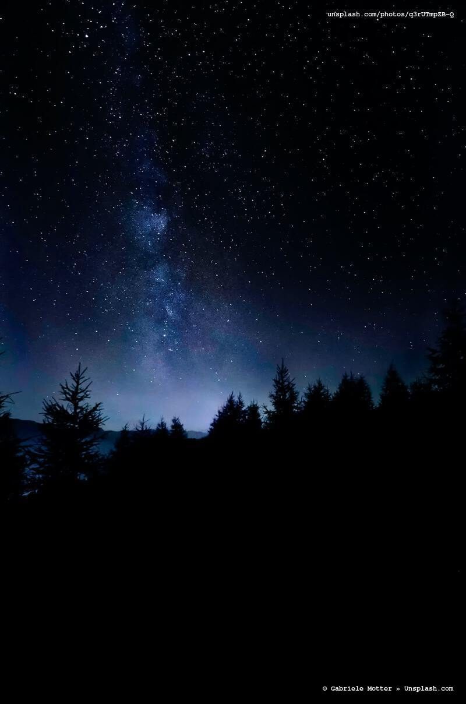
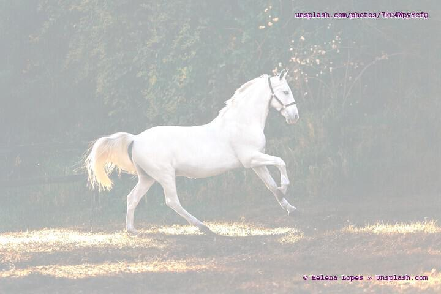
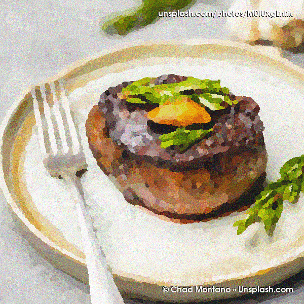
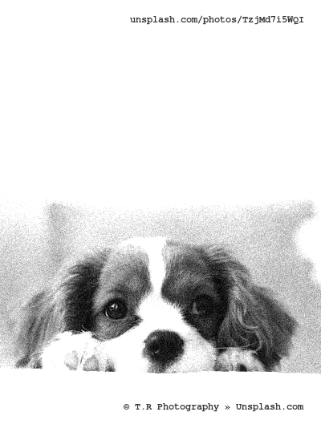
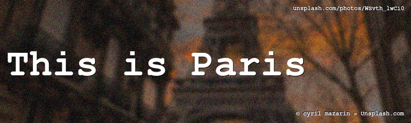

 

# splashmark

Download unsplash pics and
* resize
* crop
* add graphic affects (blur/monochrome/darken/...)
* add attribution (by saving it as EXIF/IPTC meta data)
* add watermarks (Unsplash URL or other)

## Usage

        Program: splashmark 2.1.0 created on 2020-09-28 by peter@forret.com
        Updated: Oct  2 14:58:09 2020
        Usage: splashmark [-h] [-q] [-v] [-1 <northwest>] [-2 <northeast>] [-3 <southwest>] [-4 <southeast>] [-c <height>] [-e <effect>] [-g <gravity>] [-h <titlesize>] [-i <title>] [-l <log_dir>] [-m <margin>] [-p <fonttype>] [-q <fontsize>] [-r <fontcolor>] [-t <tmp_dir>] [-w <width>] <action> <output> <input>
        Flags, options and parameters:
            -h|--help      : [flag] show usage [default: off]
            -q|--quiet     : [flag] no output [default: off]
            -v|--verbose   : [flag] output more [default: off]
            -1|--northwest <val>: [optn] text to put in left top
            -2|--northeast <val>: [optn] text to put in right top  [default: {url}]
            -3|--southwest <val>: [optn] text to put in left bottom
            -4|--southeast <val>: [optn] text to put in right bottom  [default: {copyright2}]
            -c|--height <val>: [optn] image height for cropping  [default: 0]
            -e|--effect <val>: [optn] use effect on image: bw/blur/dark/grain/light/median/paint/pixel
            -g|--gravity <val>: [optn] title gravity  [default: Center]
            -i|--title <val>: [optn] big text to put in center
            -j|--titlesize <val>: [optn] font size for title  [default: 60]
            -l|--log_dir <val>: [optn] folder for log files   [default: log]
            -m|--margin <val>: [optn] margin for watermarks  [default: 12]
            -o|--fontsize <val>: [optn] font size for watermarks  [default: 12]
            -p|--fonttype <val>: [optn] font type family to use  [default: Courier-Bold]
            -r|--fontcolor <val>: [optn] font color to use  [default: FFFFFF]
            -t|--tmp_dir <val>: [optn] folder for temp files  [default: .tmp]
            -w|--width <val>: [optn] image width for resizing  [default: 800]
            <action>  : [parameter] action to perform: download/search
            <output>  : [parameter] output file
            <input>   : [parameter] URL or search term         

## installation

1. install requirements

        # On Linux
        sudo apt install exiftool imagemagick
        # on MacOS
        brew install exiftool imagemagick

2. via [basher](https://github.com/basherpm/basher)

        basher install pforret/splashmark
        
2. or otherwise clone the repo

        git clone https://github.com/pforret/splashmark.git
        sudo ln -s splashmark/splashmark.sh /usr/bin/
        
3. configure Unsplash API keys on [unsplash.com/oauth/applications](https://unsplash.com/oauth/applications)

4. install API keys

        cp splashmark/.env.example splashmark/.env
        vi splashmark/.env
        # copy/paste `UNSPLASH_ACCESSKEY` value
 
## Example (verbose) output:

        >> ./splashmark.sh -p fonts/FiraCode-Regular.ttf -x median,light -1 "font: Fira Code, via Google Fonts" -2 "Photo: {url}" -3 "www.example.com" -4 {copyright} -v search examples/code.jpg code
        # Expect :        3 single parameter(s): action output input 
        # Found  : action=search 
        # Found  : output=examples/code.jpg 
        # Found  : input=code 
        # Program: splashmark.sh 2.0.2 
        # Updated: Oct  2 15:39:51 2020 
        # Run as : <user>>@<machine> 
        # Running: on Darwin (Darwin Kernel Version 19.6.0: Mon Aug 31 22:12:52 PDT 2020) 
        # Verify : awk basename convert cut date dirname exiftool find grep head mkdir mogrify sed stat tput uname wc  
        # Cleanup folder: [.tmp] - delete files older than 1 day(s) 
        # tmp_file: .tmp/2020-10-02.ceS5uy 
        # Cleanup folder: [log] - delete files older than 7 day(s) 
        # log_file: log/splashmark.2020-10-02.log 
        # Cache [.tmp/unsplash.9d864cff.json] 
        # URL = [https://api.unsplash.com/search/photos/?query=code&client_id=<id>] 
        # Found photo ID = 95YRwf6CNw8 
        # Cache [.tmp/unsplash.bd132d4d.json] 
        # URL = [https://api.unsplash.com/photos/95YRwf6CNw8?client_id=<id>] 
        # Download = [https://images.unsplash.com/photo-1517694712202-14dd9538aa97?(...)] 
        # Original file = [.tmp/95YRwf6CNw8.jpg] 
        # Cache [.tmp/unsplash.bd132d4d.json] 
        # URL = [https://api.unsplash.com/photos/95YRwf6CNw8?client_id=<id>] 
        # Cache [.tmp/unsplash.bd132d4d.json] 
        # URL = [https://api.unsplash.com/photos/95YRwf6CNw8?client_id=<id>] 
        # Photographer = [Clément H] 
        # SIZE: to 800 wide --> examples/code.jpg 
        # EXIF: set [Artist] to [Clément H] for [examples/code.jpg] 
        # EXIF: set [OwnerID] to [Clément H] for [examples/code.jpg] 
        # EXIF: set [OwnerName] to [Clément H] for [examples/code.jpg] 
        # EXIF: set [Credit] to [unsplash.com] for [examples/code.jpg] 
        # EXIF: set [ImageDescription] to [Photo: Clément H on Unsplash.com] for [examples/code.jpg] 
        # EFX : median 
        # EFX : light 
        # MARK: [font: Fira Code, via Google Fonts] in NorthWest corner ... 
        # MARK: [Photo: unsplash.com/photos/95YRwf6CNw8] in NorthEast corner ... 
        # MARK: [www.example.com] in SouthWest corner ... 
        # MARK: [Photo by Clément H on Unsplash.com] in SouthEast corner ... 
        examples/code.jpg
        # splashmark.sh finished after 4 seconds   

## Examples

    splashmark.sh search examples/night.jpg night

    splashmark.sh -w 720 -c 400 search examples/sunny.jpg sunny

    splashmark.sh -w 720 -c 400 -q 25 -p "Times-Roman" search examples/cocktail.jpg cocktail

    splashmark.sh -w 720 -c 480 -e light -r 660066 search examples/horse.jpg horse

    
    splashmark.sh -w 600 -c 600 -p "AvantGarde-Demi" -q 16 -e median,paint,grain  search examples/steak.gif steak

    splashmark.sh --width 400 --effect grain,bw,light --fontcolor 333333 search examples/puppy.png puppy

    splashmark.sh \
    -p fonts/FiraCode-Regular.ttf \
    -x median,light \
    -1 "font: Fira Code, via Google Fonts" \
    -2 "Photo: {url}" \
    -3 "www.example.com" \
    -4 {copyright} \
    search examples/code.jpg code

    splashmark.sh -w 800 -c 240 -e dark,blur,grain -h 75 -g West -i "This is Paris" search examples/paris.jpg paris

  
---

&copy; 2020 [Peter Forret](https://github.com/pforret)