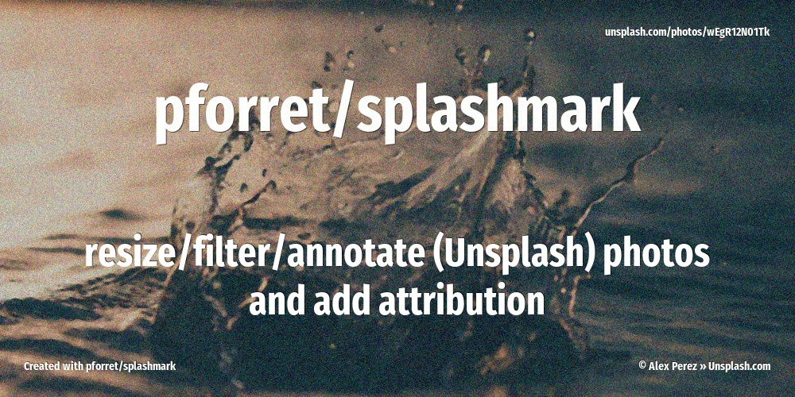
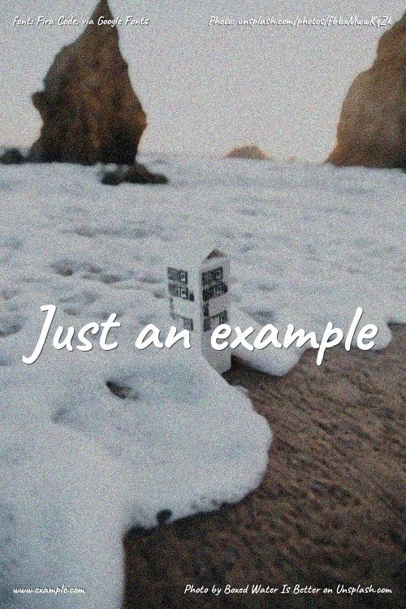

 


[](https://basher.gitparade.com/package/)

# splashmark



Remix images by
* resize/crop
* add visual FX (blur/monochrome/darken/median/grain...)
* add attribution (by saving it as EXIF/IPTC meta data)
* add watermarks (Unsplash URL or other)

Works with
* local image file
* image URL
* Unsplash image

## Usage

```
Program: splashmark 2.4.2 created on 2020-09-28 by peter@forret.com
Updated: Feb 17 10:45:58 2021
Usage: splashmark [-h] [-q] [-v] [-l <log_dir>] [-t <tmp_dir>] 
      [-1 <northwest>] [-2 <northeast>] [-3 <southwest>] [-4 <southeast>] 
      [-w <width>] [-c <crop>] [-e <effect>] [-g <gravity>] [-m <margin>] 
      [-i <title>] [-z <titlesize>] [-k <subtitle>] [-j <subtitlesize>] 
      [-o <fontsize>] [-p <fonttype>] [-r <fontcolor>] 
      [-x <photographer>] [-u <url>] [-d <randomize>] 
      [-U <UNSPLASH_ACCESSKEY>] 
      <action> <output> <input>
Flags, options and parameters:
    -h|--help      : [flag] show usage [default: off]
    -q|--quiet     : [flag] no output [default: off]
    -v|--verbose   : [flag] output more [default: off]
    -l|--log_dir <val>: [optn] folder for debug files   [default: /Users/pforret/log/splashmark]
    -t|--tmp_dir <val>: [optn] folder for temp files  [default: .tmp]
    -1|--northwest <val>: [optn] text to put in left top
    -2|--northeast <val>: [optn] text to put in right top  [default: {url}]
    -3|--southwest <val>: [optn] text to put in left bottom  [default: Created with pforret/splashmark]
    -4|--southeast <val>: [optn] text to put in right bottom  [default: {copyright2}]
    -w|--width <val>: [optn] image width for resizing  [default: 1200]
    -c|--crop <val>: [optn] image height for cropping  [default: 0]
    -e|--effect <val>: [optn] use effect chain on image: bw/blur/dark/grain/light/median/paint/pixel
    -g|--gravity <val>: [optn] title alignment left/center/right  [default: center]
    -m|--margin <val>: [optn] margin for watermarks  [default: 30]
    -i|--title <val>: [optn] big text to put in center
    -z|--titlesize <val>: [optn] font size for title  [default: 80]
    -k|--subtitle <val>: [optn] big text to put in center
    -j|--subtitlesize <val>: [optn] font size for subtitle  [default: 50]
    -o|--fontsize <val>: [optn] font size for watermarks  [default: 15]
    -p|--fonttype <val>: [optn] font type family to use  [default: FiraSansExtraCondensed-Bold.ttf]
    -r|--fontcolor <val>: [optn] font color to use  [default: FFFFFF]
    -x|--photographer <val>: [optn] photographer name (empty: get from Unsplash)
    -u|--url <val>: [optn] photo URL override (empty: get from Unsplash)
    -d|--randomize <val>: [optn] take a random picture in the first N results  [default: 1]
    -U|--UNSPLASH_ACCESSKEY <val>: [optn] Unsplash access key
    <action>  : [parameter] action to perform: download/search/file/url
    <output>  : [parameters] output file (1 or more)
    <input>   : [parameters] URL or search term (1 or more)


### TIPS & EXAMPLES
* use splashmark download to download a specific Unsplash photo and work with it (requires free Unsplash API key)
  splashmark download splash.jpg "https://unsplash.com/photos/xWOTojs1eg4"
  splashmark -i "The Title" -k "The subtitle" download output.jpg "https://unsplash.com/photos/xWOTojs1eg4"
  splashmark -i "Splash" -k "Subtitle" -w 1280 -c 640 -e dark,grain download output.jpg "https://unsplash.com/photos/xWOTojs1eg4"
* use splashmark search to search for a keyword on Unsplash and take the Nth photo (requires free Unsplash API key)
  splashmark search waterfall.jpg waterfall
  splashmark --randomize --title "Splash" --subtitle "Subtitle" --width 1280 --crop 640 --effect dark,grain search waterfall.jpg waterfall
* use splashmark file to add texts and effects to a existing image
  splashmark file waterfall.jpg sources/original.jpg
  splashmark --title "Strawberry" -w 1280 -c 640 -e dark,median,grain file waterfall.jpg sources/original.jpg
* use splashmark url to add texts and effects to a image that will be downloaded from a URL
  splashmark file waterfall.jpg "https://i.imgur.com/rbXZcVH.jpg"
  splashmark -w 1280 -c 640 -4 "Photographer: John Doe" -e dark,median,grain url waterfall.jpg "https://i.imgur.com/rbXZcVH.jpg"
* to create a social image for Github
  splashmark -w 1280 -c 640 -z 100 -i "<user>/<repo>" -k "line 1\nline 2" -r EEEEEE -e median,dark,grain search search <repo>.jpg <keyword>
* to create a social image for Instagram
  splashmark -w 1080 -c 1080 -z 150 -i "Carpe diem" -e dark search instagram.jpg clouds
* to create a social image for Facebook
  splashmark -w 1200 -c 630 -i "20 worldwide destinations\nwith the best beaches\nfor unforgettable holidays" -e dark search facebook.jpg copacabana
```

## installation

1. install requirements

```bash
# On Linux
sudo apt install exiftool imagemagick
# on MacOS
brew install exiftool imagemagick
```
2. via [basher](https://github.com/basherpm/basher)

```bash
basher install pforret/splashmark
```

2. or otherwise clone the repo
```bash
git clone https://github.com/pforret/splashmark.git
sudo ln -s splashmark/splashmark /usr/bin/
```

        
3. configure Unsplash API keys on [unsplash.com/oauth/applications](https://unsplash.com/oauth/applications)

4. install API keys

```bash
cp splashmark/.env.example splashmark/.env
vi splashmark/.env
# copy/paste `UNSPLASH_ACCESSKEY` value
```
## Example (verbose) output:

        $ splashmark -w 800 -p UbuntuMono-Bold.ttf -e median,dark,grain -1 "font: UbuntuMono Bold, via Google Fonts" -2 "Photo: {url}" -3 "www.example.com" -4 {copyright} -i "Just an example" -v search examples/example.jpg beach
        
        # Expect : 3 single parameter(s): action output input 
        # Found  : action=search 
        # Found  : output=examples/example.jpg 
        # Found  : input=beach 
        # Program: splashmark 2.3.0 
        # Updated: 2020-10-10 13:45 
        # Running: on Linux (#488-Microsoft Mon Sep 01 13:43:00 PST 2020) 
        # Verify : awk basename convert cut date dirname exiftool find grep head mkdir mogrify sed stat tput uname wc  
        # Cleanup folder: [.tmp] - delete files older than 1 day(s) 
        # tmp_file: .tmp/2020-10-19.xzAVHb 
        # Cleanup folder: [log] - delete files older than 7 day(s) 
        # log_file: log/splashmark.2020-10-19.log 
        # API = [.tmp/unsplash.f499e0ec.json] 
        # Found photo ID = fbbxMwwKqZk 
        # API = [.tmp/unsplash.4704b4c4.json] 
        # IMG = [.tmp/fbbxMwwKqZk.jpg] 
        # API = [.tmp/unsplash.4704b4c4.json] 
        # API = [.tmp/unsplash.4704b4c4.json] 
        # FONT [./fonts/UbuntuMono-Bold.ttf] exists as a splashmark font 
        # SIZE: to 800 wide --> examples/example.jpg 
        # EXIF: set [Writer-Editor] to [splashmark] for [examples/example.jpg] 
        # EXIF: set [Artist] to [Boxed Water Is Better] for [examples/example.jpg] 
        # EXIF: set [Creator] to [Boxed Water Is Better] for [examples/example.jpg] 
        # EXIF: set [OwnerID] to [Boxed Water Is Better] for [examples/example.jpg] 
        # EXIF: set [OwnerName] to [Boxed Water Is Better] for [examples/example.jpg] 
        # EXIF: set [Credit] to [Photo: Boxed Water Is Better on Unsplash.com] for [examples/example.jpg] 
        # EXIF: set [ImageDescription] to [Photo: Boxed Water Is Better on Unsplash.com] for [examples/example.jpg] 
        # EFX : median 
        # EFX : dark 
        # EFX : grain 
        # MARK: [font: UbuntuMono Bold, via Google Fonts] in NorthWest corner ... 
        # MARK: [Photo: unsplash.com/photos/fbbxMwwKqZk] in NorthEast corner ... 
        # MARK: [www.example.com] in SouthWest corner ... 
        # MARK: [Photo by Boxed Water Is Better on Unsplash.com] in SouthEast corner ... 
        # MARK: title [Just an example] in Center ... 
        examples/example.jpg
        # splashmark finished after 5 seconds



## Examples
check [EXAMPLES.md](https://github.com/pforret/splashmark/blob/master/EXAMPLES.md)


## Common image sizes
* [facebook-profile-picture-size-and-more](https://www.godaddy.com/garage/facebook-profile-picture-size-and-more/)
---

&copy; 2020 [Peter Forret](https://github.com/pforret)