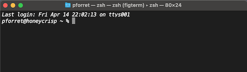
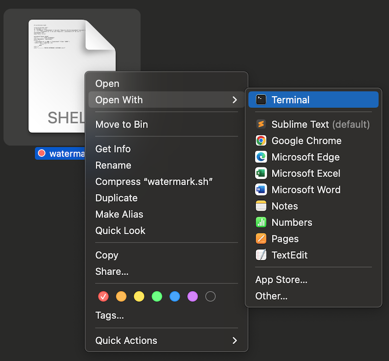
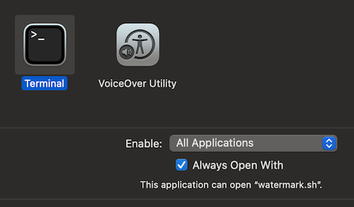
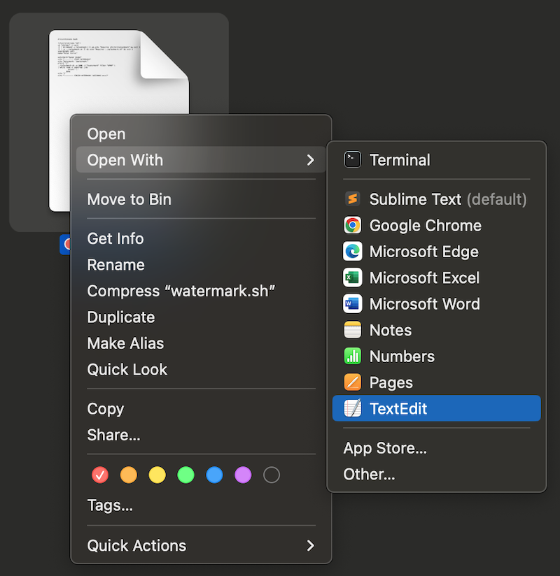
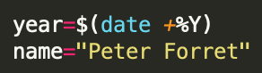
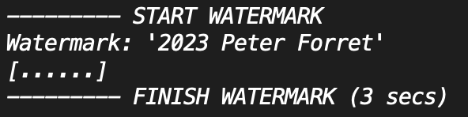

# Watermarking photos

You probably got sent here because you tried to execute "`watermark.sh`" on your PC (MacBook) and you still need to install some programs before that can work.

Here's what you need to do:

## install basher & splashmark
Open a terminal window (Apple-Space and type 'terminal')



Now you need to type the following lines (only the ones that don't start with #)

```bash
# first we will install BASHER - package manager for bash scripts
# procedure explained on https://www.basher.it/ or https://github.com/basherpm/basher/blob/master/README.md
curl -s https://raw.githubusercontent.com/basherpm/basher/master/install.sh | bash

# now open a new bash session, so that the basher scripts can be easily found
bash

# let's test if basher was properly installed
basher
# expected output:
# Usage: basher <command> [<args>]
#    
# Some useful basher commands are:
#       help        Display help for a command
#       commands    List all available basher commands
#       init        Configure the shell environment for basher

# let's install splashmark, which is need for the watermark.sh script
basher install pforret/splashmark

# to test if the installation worked, just type splashmark, it will give some usage info
splashmark
# expected output:
# Program : splashmark  by peter@forret.com
# Version : v3.5.0 (Apr 14 21:33:20 2023)
# Purpose : Mark up images (unspash/pixabay/URL) with titles, effects and resize
# (...)

# install the requirements
# On Linux (Ubuntu)
sudo apt install exiftool imagemagick jq
# on MacOs
brew install exiftool imagemagick jq
```

## Configure your watermark

Put the `watermark.sh` script in the folder of your exported, but not yet watermarked photos.
Make sure that when you double-click the .sh script, it will open with the `terminal` program



If your computer opens .sh files with a text editor (as is the default), then choose `Terminal` via the 'Other...' popup. `Terminal` is located in the 'Utilities' subfolder of Applications.



Open watermark.sh with a text editor.



Change the photographer name to what you want.



## Watermark your photos

Put the `watermark.sh` script in the folder of your exported, but not yet watermarked photos.
Double-click the `watermark.sh` icon. A Terminal window will pop up and start executing the script.



Watermarks will be added like this 

